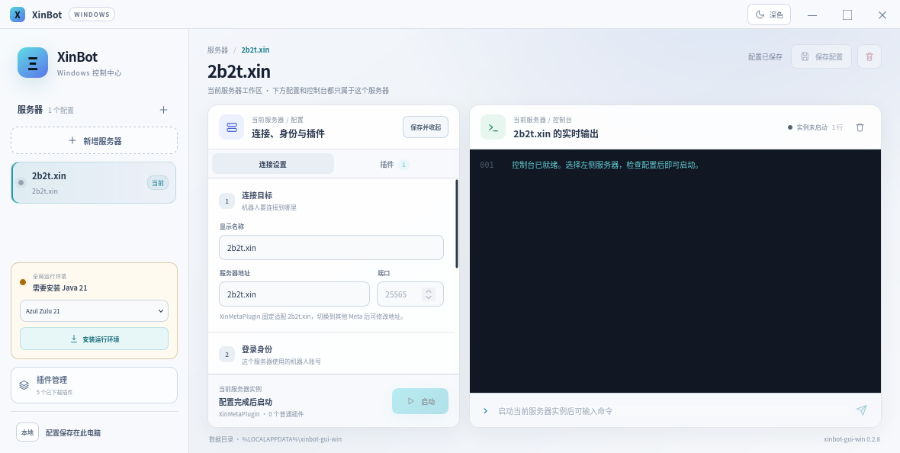

# XinBot Windows

A Windows-only control center for [XinBot](https://github.com/huangdihd/xinbot), built with
Tauri 2, Rust and Svelte.

[简体中文](README.zh-CN.md) · [Download the latest release](https://github.com/newPlayerAL/xinbot-gui-win/releases/latest)



_Shown with local preview data; no real account or server credentials are included._

## Features

- Run multiple server profiles concurrently. Every profile has its own XinBot process, working
  directory, configuration, plugin set, console output and command input.
- Edit or start another profile while bots are running; one instance does not block the others.
- Configure an HTTP, SOCKS4, or SOCKS5 proxy separately for each server profile.
- Manage Meta plugins separately from ordinary plugins, import local plugin JARs, and browse the
  official plugin catalog.
- Configure plugins per server. Known native configuration files can be edited in the app, and
  plugins can be loaded briefly to generate their default configuration without connecting to a
  Minecraft server.
- Use the bundled BackToTheBase plugin without a separate download. Its player locations, return
  point, administrators and language have a dedicated visual editor with a raw JSON fallback.
- Download a private Java 21 runtime on first launch. The runtime is checksum-verified and isolated
  from the system `PATH`; Azul Zulu is preferred, with Eclipse Temurin and Microsoft OpenJDK as
  fallbacks.
- Bundle a Windows x86-64 optimized XinBot Core while keeping the normal Core build cross-platform.

## Install

1. Open the [latest GitHub release](https://github.com/newPlayerAL/xinbot-gui-win/releases/latest).
2. Download `XinBot_0.2.8_x64-setup.exe`.
3. Verify its SHA-256 checksum against `SHA256SUMS.txt`, then run the installer.

Requirements:

- Windows 10 or Windows 11, x86-64.
- Internet access on first launch to download Java 21.
- The installer is not code-signed yet, so Windows SmartScreen may show an unknown-publisher
  warning. Verify the checksum before continuing.

Upgrades preserve application data under:

```text
%LOCALAPPDATA%/io.github.newplayeral.xinbot-gui-win/
```

Server profiles may contain secondary-login and proxy passwords. They are stored locally in the
WebView profile and are not encrypted; do not use valuable passwords there. The proxy setting
only applies to XinBot Core's Minecraft server connection, not Java downloads, web access, or
Microsoft authentication.

## Data layout

```text
%LOCALAPPDATA%/io.github.newplayeral.xinbot-gui-win/
  runtime/java-21/           private Java runtime
  downloads/                resumable `.part` archives
  plugin-library/           user-imported XinBot plugin JARs
  instances/<stable-id>/    generated config, plugins and logs
```

This application uses its own data layout and does not import the legacy Java GUI configuration.

## Development

Frontend preview:

```bash
npm ci
npm run dev
```

A complete Windows build also needs Rust with the MSVC target, the Tauri 2 Windows prerequisites,
Java 17+ and Maven. Build the companion projects first and place them next to this repository:

For version 0.2.8, download and extract the
[matching XinBot Core source archive](https://github.com/newPlayerAL/xinbot-gui-win/releases/download/v0.2.8/xinbot-core-2.4.3-gui-0.2.8-source.tar.gz)
as `workspace/xinbot`.

```text
workspace/
  xinbot/          matching Core source for this GUI release
  ChatFilter/
  xinbot-gui-win/
```

Then run on Windows:

```powershell
cd ../xinbot
mvn -Pwindows-x86_64 clean install

cd ../ChatFilter
mvn package

cd ../xinbot-gui-win
mvn -f bundled-plugins/directconnect/pom.xml package
./scripts/prepare-resources.ps1
npm ci
npm run tauri -- build --target x86_64-pc-windows-msvc
```

`prepare-resources.ps1` copies the built companion JARs, downloads checksum-pinned BackToTheBase
and MovementSync inputs, assembles a slim MovementSync JAR, and keeps only Windows x86-64 native
libraries in the bundled Core. The source Core's normal `mvn package` output is not modified.

## Source and licenses

This project is licensed under `GPL-3.0-or-later`; see [LICENSE](LICENSE). Sources and licenses for
the bundled Core and plugins are listed in [THIRD_PARTY_NOTICES.md](THIRD_PARTY_NOTICES.md).

XinBot and Minecraft are separate projects. This application is not affiliated with or endorsed by
Mojang Studios or Microsoft.
